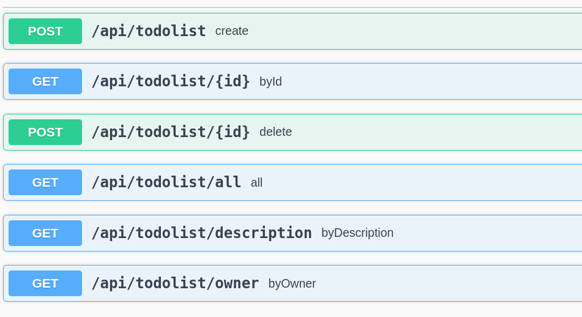

# redis-om-todo



```shell
mvn spring-boot:run
```

References:

* https://redis.io/docs/stack/get-started/tutorials/stack-spring/
* https://redis.io/docs/stack/get-started/install/docker/
* https://github.com/redis/redis-om-spring/issues/86


